## An Overview of MQTT 

[MQTT](http://docs.oasis-open.org/mqtt/mqtt/v3.1.1/os/mqtt-v3.1.1-os.html) is a Client Server publish/subscribe messaging transport protocol. It is light weight, open, simple, and designed so as to be easy to implement. These characteristics make it ideal for use in many situations, including constrained environments such as for communication in Machine to Machine (M2M) and Internet of Things (IoT) contexts where a small code footprint is required and/or network bandwidth is at a premium.

The protocol runs over TCP/IP, or over other network protocols that provide ordered, lossless, bi-directional connections. Its features include:

-  Use of the publish/subscribe message pattern which provides one-to-many message distribution and decoupling of applications.
-  A messaging transport that is agnostic to the content of the payload.
-  Three qualities of service for message delivery:
  - "At most once", where messages are delivered according to the best efforts of the operating environment. Message loss can occur. This level could be used, for example, with ambient sensor data where it does not matter if an individual reading is lost as the next one will be published soon after.
  - "At least once", where messages are assured to arrive but duplicates can occur.
  - "Exactly once", where message are assured to arrive exactly once. This level could be used, for example, with billing systems where duplicate or lost messages could lead to incorrect charges being applied.
-  A small transport overhead and protocol exchanges minimized to reduce network traffic.
-  A mechanism to notify interested parties when an abnormal disconnection occurs.

## [MQTT Architecture](https://www.eclipse.org/community/eclipse_newsletter/2014/february/article2.php) 

MQTT has a client/server model, where every sensor is a client and connects to a server, known as a broker, over TCP.

MQTT is message oriented. Every message is a discrete chunk of data, opaque to the broker.

Every message is published to an address, known as a topic. Clients may subscribe to multiple topics. Every client subscribed to a topic receives every message published to the topic.

For example, imagine a simple network with three clients and a central broker.

All three clients open TCP connections with the broker. Clients B and C subscribe to the `topic temperature` .

 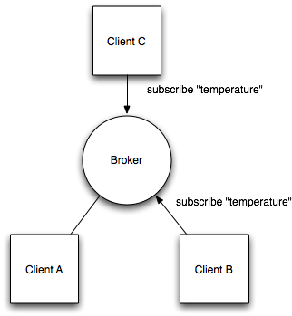

At a later time, Client A publishes a value of `22.5` for topic `temperature` . The broker forwards the message to all subscribed clients.

 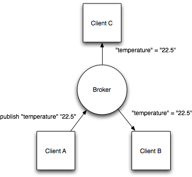


The publisher subscriber model allows MQTT clients to communicate one-to-one, one-to-many and many-to-one.

## [Adafruit MQTT Configuration](https://learn.adafruit.com/adafruit-io/mqtt-api) 

Adafruit support the MQTT protocol through the Adafruit MQTT IO platform.

| Host         | io.adafruit.com                          |
| ------------ | ---------------------------------------- |
| **Port**     | 1883 or 8883 (for SSL encrypted connection) |
| **Username** | Adafruit account username                |
| **Password** | Adafruit IO key                          |

### Getting an Adafruit IO Account 

Navigate to [io.adafruit.com](https://io.adafruit.com/)  and create an  account.

In your dashboard, create a new feed or if you prefer to group your feeds, create a new feed group .

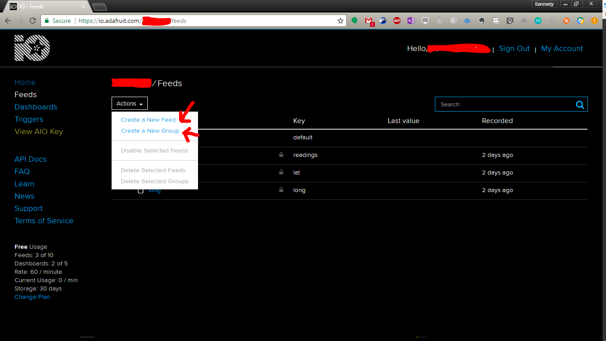

Your feeds might now look something similar to this

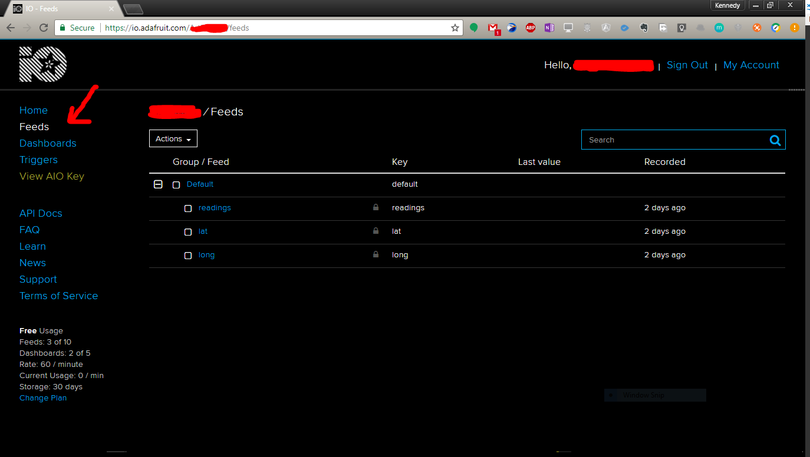

To obtain your IO credentials, click on the **View AIO Key** link  

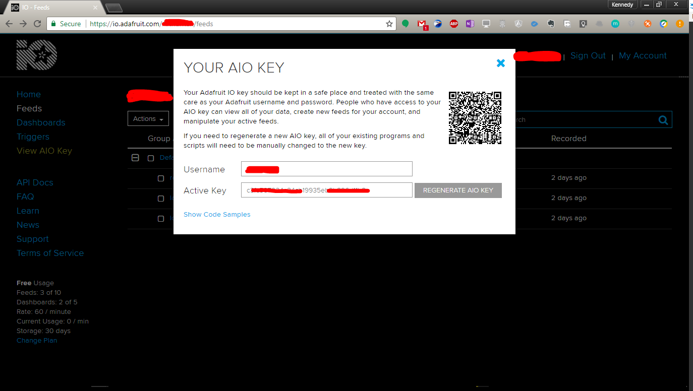

To obtain readings and use them on other services such as mobile applications, web applications e.t.c. Click on **API Docs** to display all links and relevant endpoints to your feeds (topics in the MQTT context). Also, for each feed clicking on **Feed Information**  will give similar information as previous action but for each individual feed.

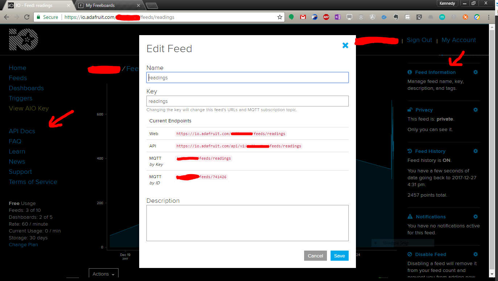

## Data Visualization

Adafruit IO offers an ad-hoc visualization service, however for a free account you're limited to using the tool in their website. [Freeboard](https://freeboard.io/) offers a free and hosted visualization tool that you can easily configure to display your feed data in real-time. 

With  a Freeboard account it is very simple to configure and host a visualization dashboard for your sensor as well as configure triggers( you can  start or stop processes remotely). 


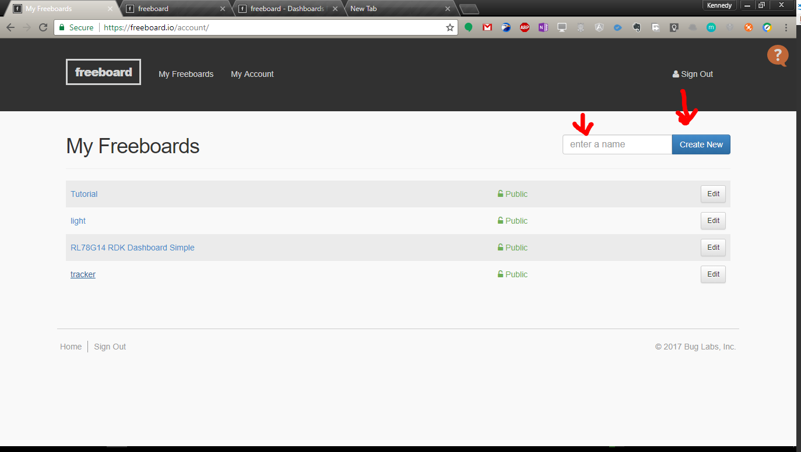

One can quickly set up a dashboard by adding a pane(this is  a canvas on which your data will be rendered) for this click on the **Add Pane** link, give your pane a name. Thereafter click on the **+** button to add a widget (widget are data containers belonging to a particular pane). Each widget type depends on the type of data to be displayed. You can also import a premade configuration file (JSON object detailing data sources and widgets). 

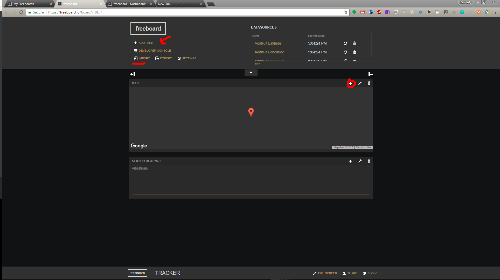

To configure our data sources we click on **Add** button and add a new **JSON** (- <u>JavaScript Object Notation - is a lightweight data-interchange format</u>) data source. Adafruit IO API will be our data source. 

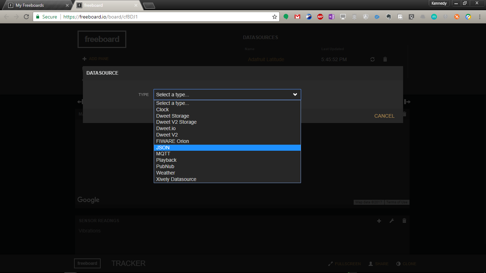

We can also add a raw MQTT data source given MQTT broker authentication details (which are not given by Adafruit in this case).

A sample configuration could look like so 

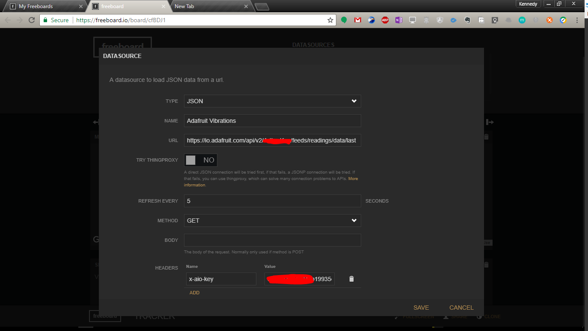

In the above configuration we're getting JSON objects from Adafruit IO API for our *readings* channel and we add a refresh time in seconds to act as our polling time (period between subsequent API calls).

## Code 

### Setting up the libraries

The following libraries are as below and their contributions.

|  Library Name  |                   Role                   |            Source Code / Link            |
| :------------: | :--------------------------------------: | :--------------------------------------: |
|    TinyGSM     | Exposes a client interface for networking modules such as GSM , XBee |  https://github.com/vshymanskyy/TinyGSM  |
|  Adafuit MQTT  | An MQTT library that handles communications between A client device and a remote MQTT broker | https://github.com/adafruit/Adafruit_MQTT_Library |
| SoftwareSerial | A library that supports serial communications | https://www.arduino.cc/en/Reference/SoftwareSerial |
| LiquidCrystal  | A library that facilitates control of Liquid Crystal Displays based on the  Hitachi HD44780 compatible chipsets | https://www.arduino.cc/en/Reference/LiquidCrystal |

These libraries can be downloaded as zip files from their respective **Release** page as given in the links above and added as follows.

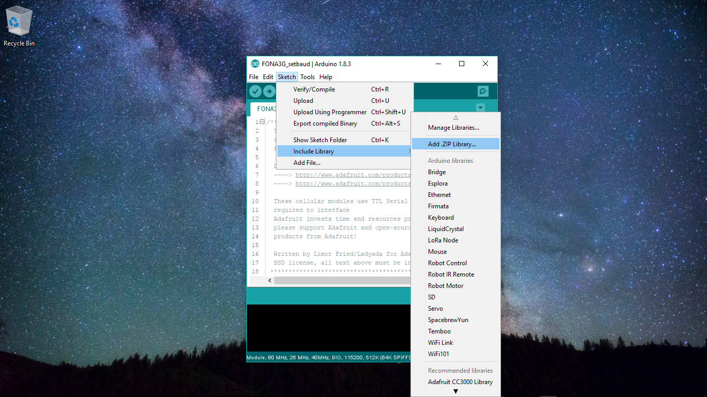

### Walking through the code 

```c++
#include <TinyGsmClient.h>
#include <LiquidCrystal.h>
#include <Adafruit_MQTT.h>
#include <Adafruit_MQTT_Client.h>
#include <SoftwareSerial.h> // Necessary for Arduino Uno
```

The above preprocessor directives links our project to the aforementioned libraries during compile time.

```c++
#define TINY_GSM_MODEM_SIM808
```

This preprocessor directive alerts the compiler that we'll be compiling against the **SIM808** module as defined in the **TinyGSM** library.

Next up, we define a bunch of variables we'll use in our code:

```c++
boolean shouldLatch = false; //This boolean variable determines whether to run the DC motor or not
byte motorPin = 8; // We have set the dc motor pin to PWM pin 8

byte tiltSensorPin = 9; // Incase we're using a Tilt sensor instead of an analog sensor

#define OK_LED_PIN 13 // This is the default LED pin on Arduino Mega and UNO we'll use it to indicate status

/*
Setting for The GSM Client
Refer to your network provider for details
*/
const char apn[]  = "saf";
const char user[] = "safaricom";
const char pass[] = "data";
#define SerialAT Serial1 // This will setup serial communication between the GSM module and our board
/*
Credentials will be obtained from Adafruit
*/
#define AIO_SERVER      "io.adafruit.com"
#define AIO_SERVERPORT  1883
#define AIO_USERNAME    "myusername"
#define AIO_KEY         "mykey"
int32_t vibrationPinValue; // Values from the vibration sensor
float longitude, latitude; // Location co-ordinates
// ...A series of variables representing our MQTT topics(feeds)
Adafruit_MQTT_Publish readings = Adafruit_MQTT_Publish(&mqtt, AIO_USERNAME "/feeds/readings");
Adafruit_MQTT_Publish location_lat = Adafruit_MQTT_Publish(&mqtt, AIO_USERNAME "/feeds/lat");
Adafruit_MQTT_Publish location_long = Adafruit_MQTT_Publish(&mqtt, AIO_USERNAME "/feeds/long");

const int rs = 12, en = 11, d4 = 5, d5 = 4, d6 = 6, d7 = 7; // LCD pin setup
```

We'll also initialize instances of several classes used in our code, such as LCD and GSM (modem).

```c++

TinyGsm modem(SerialAT); // we create an instance of our tinyGSM class library
TinyGsmClient gsmClient(modem); // And initialize it the GSM client.

LiquidCrystal lcd(rs, en, d4, d5, d6, d7); // this initializes an LCD instance

Adafruit_MQTT_Client mqtt(&gsmClient, AIO_SERVER, AIO_SERVERPORT, AIO_USERNAME, AIO_KEY); // An mqtt client instance which takes several parameters including our GSM cient.

```

Next in our `setup` function we'll configure our GSM, initialize our LCD, setup serial communication and define pin-modes for our actuators.

```c++
void setup(void)
{
    // Set Up LCD
    initiaLizeLCD();
    // debug only...
    Serial.begin(9600);
    while(!Serial)
    {
        ;
    }
    pinMode(OK_LED_PIN, OUTPUT);
    pinMode(motorPin, OUTPUT);
    configureGsm();
}
```

In the `loop` function we're going to call on various other functions to run continuously; such as: 

- Connect to MQTT server
- Get value of the vibration sensor
- Properly format the location data from the GSM's GPS module 
- Publish the data to our MQTT server 

```c++
void loop(void)
{
    MQTT_connect();
    delay(100);
    int data = getVibrationValue(); // Get data from Vibration sensor
    data > 500 ? shouldLatch == true : shouldLatch; // Controls motor
    runMotor();
    char *  gps_raw  = (char *) malloc (100);
    String gps_p = modem.getGPSraw(); // Typically looks like this "0,4043.576433,7400.316980,58.647405,20150601201258.000,64,12,0.548363,100.442406"
    gps_p.toCharArray(gps_raw,100);
    char * latlong  = gps_raw;
    processLocation(latlong);
    processReadings(data, longitude, latitude);
}
```

Here's a look at these functions in depth

Getting vibration value 

```c++
int32_t getVibrationValue(void)
{
    vibrationPinValue = analogRead(A0); // We're reading analog values from the A0 pin
    return vibrationPinValue; // We return this value as an integer
}
```

Initializing LCD... We're basically using a 16x2 LCD and setting the cursor to origin. 

```c++
void initiaLizeLCD(void)
{
     lcd.begin(16, 2);
     lcd.print("LCD Initialized!");
     delay(1500);
     lcd.clear();
}
```

Publishing data to our Adafruit IO MQTT server. We're also displaying a critical error if vibration values are above 500 

```c++
void processReadings(int32_t value, float lon, float lat)
{
    char values[50] ;
    snprintf(values,16,"%lu",value);
    //if value is above 1024/2 something has happened
    readings.publish(value);
    location_long.publish(lon, 3);
    location_lat.publish(lat, 3);
    if(value >= 500)
    {
        lcd.print("CRITICAL VALUES");
        lcd.print(values);
    }   
        lcd.clear(); 
        lcd.print(values);
        delay(500);
        lcd.clear();
        delay(1200);
}
```

Processing the location data from the Raw GPS output can be done by this function that converts the values to float for publishing

```c++
void processLocation(char * locPayload)
{
    String lt(locPayload[2]);
    String lg(locPayload[1]);
    double l_t = lt.toFloat()/100;
    double l_g = lg.toFloat()/100;
    longitude = l_g;
    latitude = l_t;
}
```

The function below helps us configure our SIM808 module including unlocking the SIM module 

```c++
void configureGsm(void)
{
  SerialAT.begin(115200);
  delay(3000);
  modem.init(); //Skip to init() avoid long restart()

  // Unlock your SIM card with a PIN
  //modem.simUnlock("1234"); // Un-comment and add SIM PIN

  if (!modem.waitForNetwork()) {
    lcd.print("GSM FAILED!");
    delay(1500);
    lcd.clear();
    digitalWrite(OK_LED_PIN,1);
    delay(500);
    digitalWrite(OK_LED_PIN,0);
    digitalWrite(OK_LED_PIN,1);
    delay(500);
    digitalWrite(OK_LED_PIN,0);
    digitalWrite(OK_LED_PIN,1);
    delay(500);
    digitalWrite(OK_LED_PIN,0);
    while (true);
  }
lcd.print("LOOKS GOOD");
delay(1500);
lcd.clear();
  if (!modem.gprsConnect(apn, user, pass)) {
    lcd.print("GSM FAILURE!");
    digitalWrite(OK_LED_PIN,1);
    delay(500);
    digitalWrite(OK_LED_PIN,0);
    digitalWrite(OK_LED_PIN,1);
    delay(500);
    digitalWrite(OK_LED_PIN,0);
    digitalWrite(OK_LED_PIN,1);
    delay(500);
    digitalWrite(OK_LED_PIN,0);
    while (true);
  }
  lcd.clear();
  lcd.print("GSM SUCCESS!");
  delay(1500);
  lcd.clear();
  digitalWrite(OK_LED_PIN,1);
  delay(500);
  digitalWrite(OK_LED_PIN,0);
    modem.enableGPS(); // We enable GPS mode to get location data
}
```

Another function we look at is the one that helps us connect to the MQTT server 

```c++
void MQTT_connect() {
    int8_t ret;
    if (mqtt.connected()) {
      return;
    }
    lcd.clear();
    lcd.print("CONNECTING..");
    uint8_t retries = 3;
    while ((ret = mqtt.connect()) != 0) { 
         Serial.println(mqtt.connectErrorString(ret));
         lcd.print("RETRYING...");
         mqtt.disconnect();
         delay(5000);
         retries--;
         if (retries == 0) {
           while (1);
         }
    }
    lcd.clear();
    lcd.print("CONNECTED!");
    delay(500);
    lcd.clear();
  }
```

Finally we stop the motor when we read anything above 500 from the vibration sensor otherwise we keep it running.

```c++
void runMotor(void)
{
    int speed = 135; // Less than 255
    shouldLatch ? analogWrite(motorPin, 0) : analogWrite(motorPin, speed);
}
```

